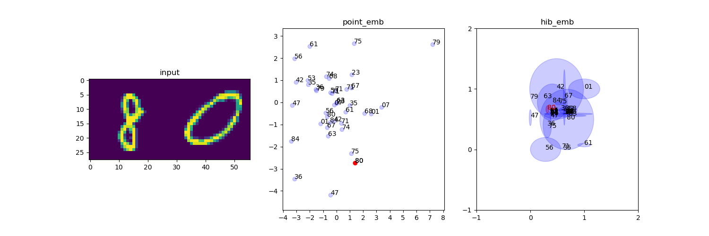
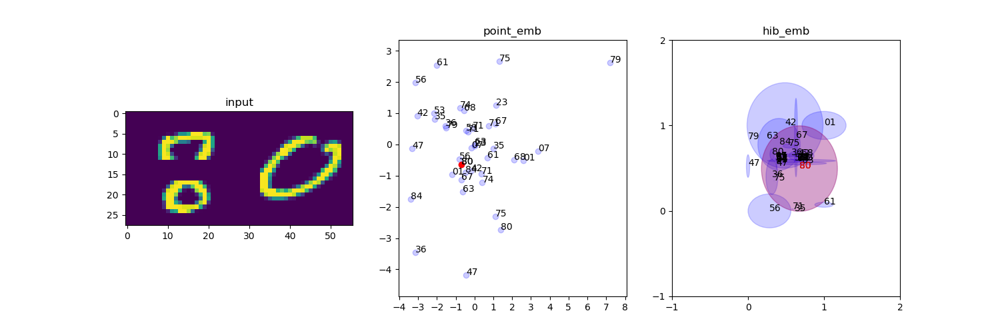
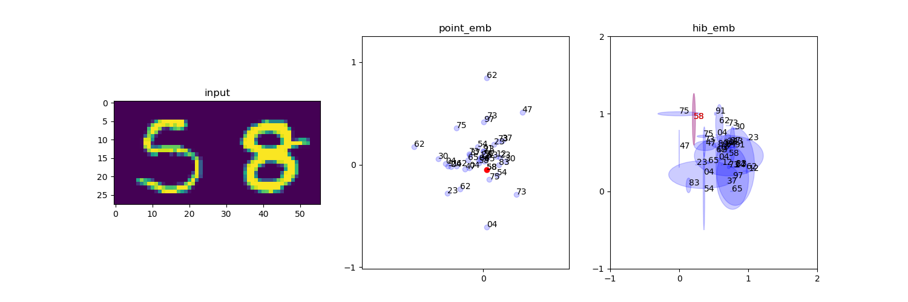
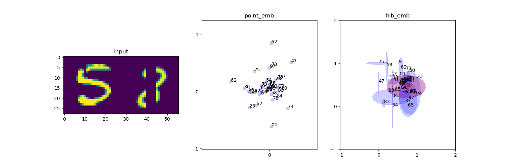

# hedged_instance_embedding
embedding method for measuring uncertainty

# Introduction(from abstract)

Often the distance between points is used as a proxy for match confidence. However, this can fail to represent uncertainty arising when the input is ambiguous, e.g., due to occlusion or blurriness

This work addresses this issue and explicitly models the uncertainty by hedging the location of each input in the embedding space.

# Dependency

- numpy 1.16.3
- tensorflow 2.0
- tfp-nightly 0.7.0 
- matplotlib 3.0.3
- sklearn 0.21.1

# Usage

- train

```python
python train.py [option]
```
- visualize

```python
python visualize.py [option]
```

# Method

## soft constrative loss: point embedding loss

In [paper](https://arxiv.org/pdf/1810.00319.pdf), see 2 - 1 - (3)


## VIB loss: hedged instance embedding loss

In [paper](https://arxiv.org/pdf/1810.00319.pdf), see 2 - 3 - (8)


# Result: Point Emb VS HIB Emb

- Input image 80: clean vs occlusion




- Input image 58: clean vs occlusion




# Reference

- [Modeling Uncertainty with Hedged Instance Embedding](https://arxiv.org/pdf/1810.00319.pdf)
